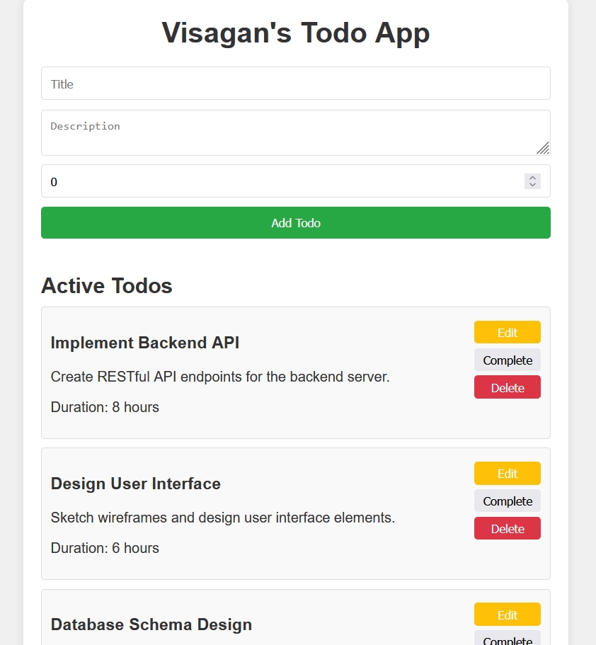
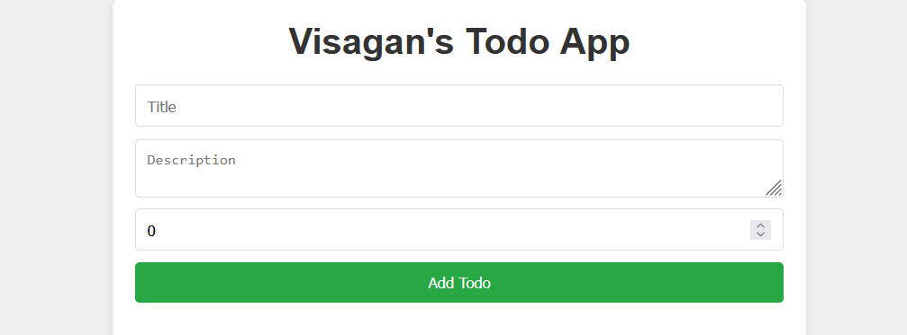
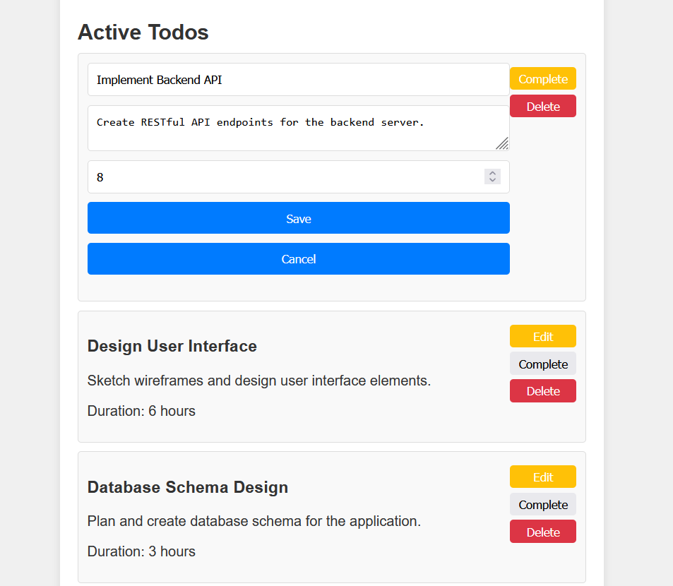
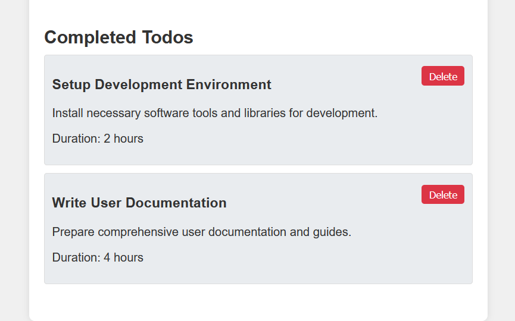

---

# Visagan's Todo App

A comprehensive MERN stack application to manage your todos efficiently. This application enables users to add, edit, delete, mark as complete, and view todos seamlessly.

## Table of Contents

- [Features](#features)
- [Technologies Used](#technologies-used)
- [Folder Structure](#folder-structure)
- [Installation](#installation)
- [Running the Application](#running-the-application)
- [API Endpoints](#api-endpoints)
- [Frontend Functionality](#frontend-functionality)
- [Screenshots](#screenshots)
- [Contact](#contact)

## Features

- Add new todos with titles, descriptions, and durations.
- Edit existing todos to modify their details.
- Delete todos from the list.
- Mark todos as complete.
- View all todos along with their completion status.

## Technologies Used

### Frontend

- HTML
- CSS
- JavaScript (Vanilla)
- TypeScript (for type safety)
- React (for a modularized approach)

### Backend

- Node.js
- Express.js
- MongoDB
- Mongoose
- dotenv (for environment variables)

## Folder Structure

```
project-root/
├── backend/
│   ├── config/
│   │   └── db.js
│   ├── controllers/
│   │   └── todoController.js
│   ├── models/
│   │   └── todoModel.js
│   ├── routes/
│   │   └── todoRoutes.js
│   ├── .env
│   ├── server.js
│   └── package.json
└── frontend/
    ├── public/
    │   └── index.html
    ├── src/
    |   |── assets/styles
    |   |  └── styles.css
    │   ├── components/
    │   │   ├── TodoForm.tsx
    │   │   └── TodoItem.tsx
    |   |── types/
    |   |  └── todo.d.ts
    │   ├── App.tsx
    │   └── index.tsx
    ├── package.json
    └── README.md
```

## Installation

### Prerequisites

- Node.js
- MongoDB (Ensure MongoDB is running on your local machine or provide a MongoDB Atlas URI in the `.env` file)
- npm or yarn (package managers)

### Backend Setup

1. Clone the repository:
   ```bash
   git clone https://github.com/VisaganSP/todo-app-mern.git
   cd todo-app/backend
   ```

2. Install backend dependencies:
   ```bash
   npm install
   ```

3. Create a `.env` file in the `backend` directory and add the following:
   ```plaintext
   PORT=3000
   MONGO_URI=mongodb://localhost:27017/todoDB
   ```

4. Start the backend server:
   ```bash
   npm run dev
   ```

### Frontend Setup

1. Navigate to the `frontend` directory:
   ```bash
   cd ../frontend
   ```

2. Install frontend dependencies:
   ```bash
   npm install
   ```

3. Start the frontend application:
   ```bash
   npm run dev
   ```

## Running the Application

After completing the installation steps, you can run the application with the following steps:

1. Start the backend server:
   ```bash
   cd backend
   npm run dev
   ```

2. Start the frontend application:
   ```bash
   cd frontend
   npm run dev
   ```

Open your browser and navigate to `http://localhost:3000` to see the application in action.

## API Endpoints

### Base URL

`http://localhost:3000/api/todos`

### Endpoints

- **GET /**: Fetch all todos
- **POST /**: Add a new todo
- **PUT /:id**: Update a todo by ID
- **DELETE /:id**: Delete a todo by ID
- **GET /completed**: Fetch all completed todos

## Frontend Functionality

- **Add Todo**: Use the form to add a new todo. Enter the title, description, and duration.
- **Edit Todo**: Click the "Edit" button next to a todo to update its details.
- **Delete Todo**: Click the "Delete" button next to a todo to remove it from the list.
- **Mark as Complete**: Click the "Complete" button next to a todo to mark it as completed.
- **View Todos**: See a list of all todos along with their details.

## Screenshots









## Contact

For any questions or suggestions, please reach out to [visagansvvg@gmail.com](mailto:visagansvvg@gmail.com).

---